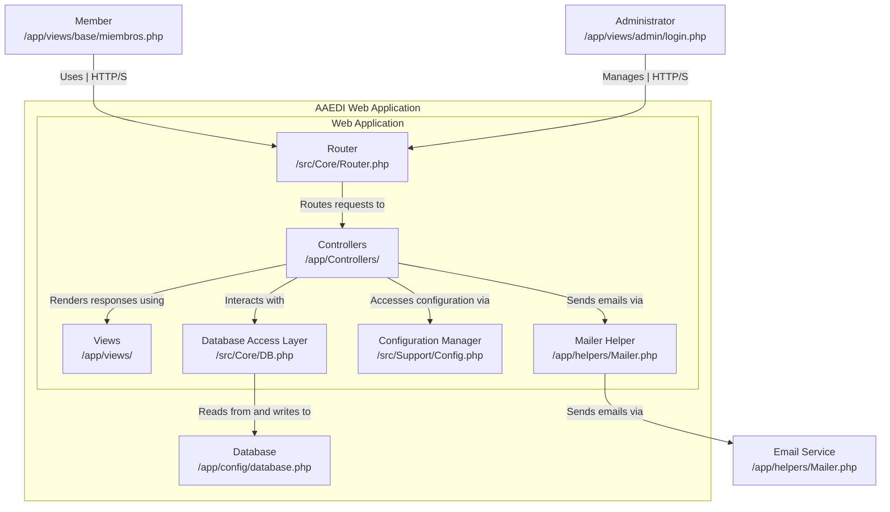

# Unnamed CodeViz Diagram

```mermaid
graph TD

    member["Member<br>/app/views/base/miembros.php"]
    admin["Administrator<br>/app/views/admin/login.php"]
    email_service["Email Service<br>/app/helpers/Mailer.php"]
    subgraph aaedi_web_app_boundary["AAEDI Web Application<br>[External]"]
        database["Database<br>/app/config/database.php"]
        subgraph web_application_boundary["Web Application<br>[External]"]
            router["Router<br>/src/Core/Router.php"]
            controllers["Controllers<br>/app/Controllers/"]
            views["Views<br>/app/views/"]
            db_access["Database Access Layer<br>/src/Core/DB.php"]
            config_manager["Configuration Manager<br>/src/Support/Config.php"]
            mailer_helper["Mailer Helper<br>/app/helpers/Mailer.php"]
            %% Edges at this level (grouped by source)
            router["Router<br>/src/Core/Router.php"] -->|"Routes requests to"| controllers["Controllers<br>/app/Controllers/"]
            controllers["Controllers<br>/app/Controllers/"] -->|"Renders responses using"| views["Views<br>/app/views/"]
            controllers["Controllers<br>/app/Controllers/"] -->|"Interacts with"| db_access["Database Access Layer<br>/src/Core/DB.php"]
            controllers["Controllers<br>/app/Controllers/"] -->|"Sends emails via"| mailer_helper["Mailer Helper<br>/app/helpers/Mailer.php"]
            controllers["Controllers<br>/app/Controllers/"] -->|"Accesses configuration via"| config_manager["Configuration Manager<br>/src/Support/Config.php"]
        end
        %% Edges at this level (grouped by source)
        db_access["Database Access Layer<br>/src/Core/DB.php"] -->|"Reads from and writes to"| database["Database<br>/app/config/database.php"]
    end
    %% Edges at this level (grouped by source)
    member["Member<br>/app/views/base/miembros.php"] -->|"Uses | HTTP/S"| router["Router<br>/src/Core/Router.php"]
    admin["Administrator<br>/app/views/admin/login.php"] -->|"Manages | HTTP/S"| router["Router<br>/src/Core/Router.php"]
    mailer_helper["Mailer Helper<br>/app/helpers/Mailer.php"] -->|"Sends emails via"| email_service["Email Service<br>/app/helpers/Mailer.php"]

```
---
*Generated by [CodeViz.ai](https://codeviz.ai) on 29/9/2025, 11:13:20*
